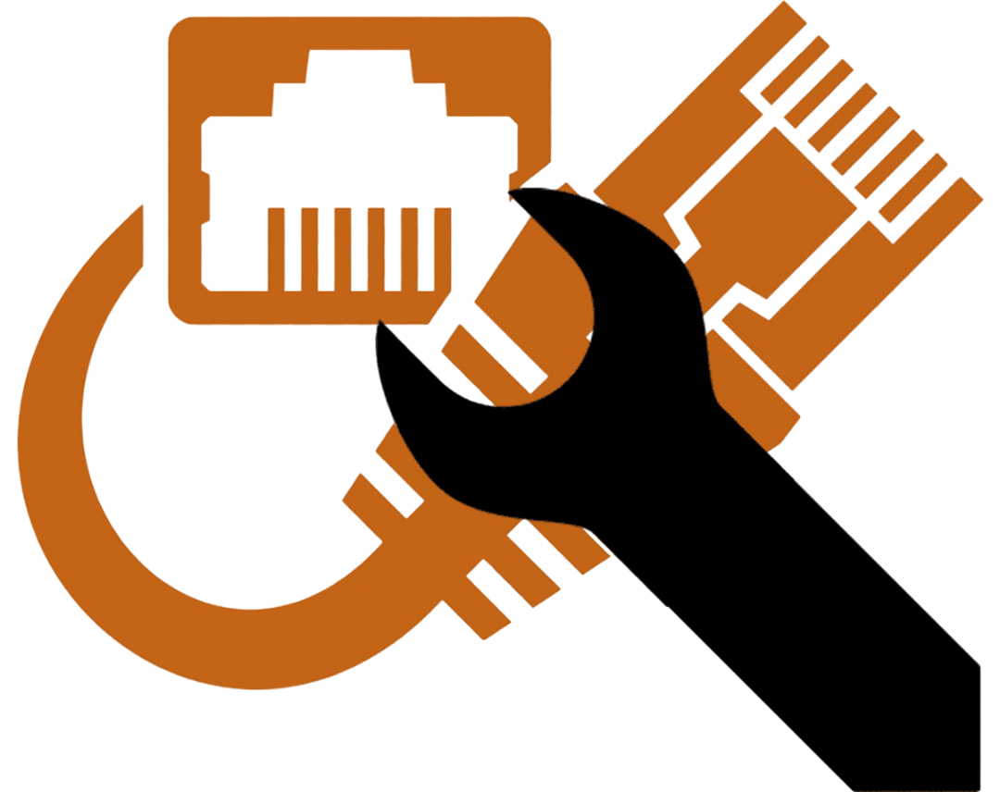
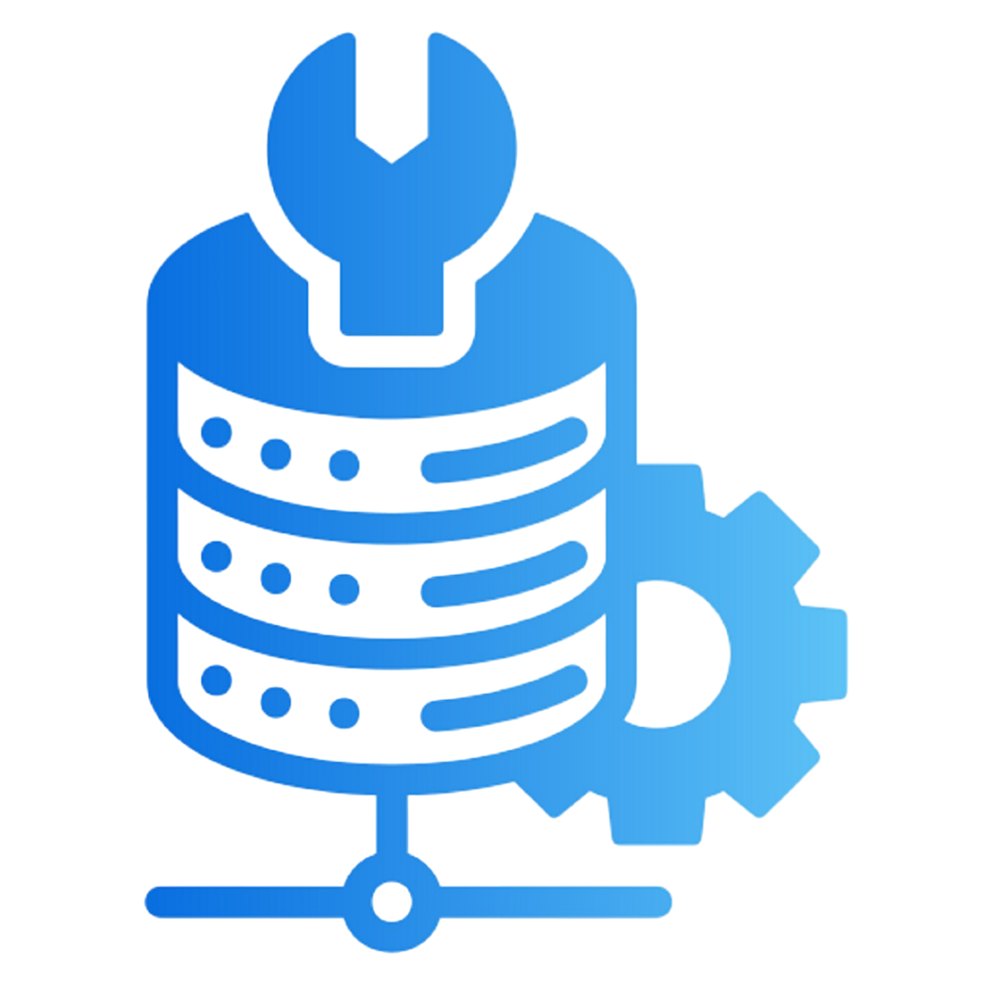
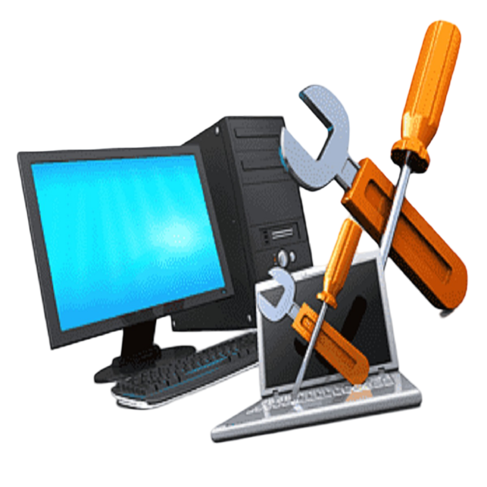

<!-- Sección de íconos sociales -->
<h1 align="center"> Redes Sociales: </h1>

  
  
  

<!-- Descripción sobre mí -->
<h2 align="center"> 🤔 Sobre mí 👨‍💻 </h2>

¡¡¡Hola!!!  
Me llamo <b>Jhonatan Bruno G.C</b>, mejor conocido como <b>'JhonatanBDev'</b> 🕵🏼‍♂️  
Soy de <strong>Bolivia, La Paz</strong> 🇧🇴  
Soy un chico al que le encanta desarrollar cosas nuevas 🖥️  
Así que… soy más que un robot programando 🤖, soy un chico intentando aprender cosas nuevas y desarrollar proyectos increíbles con ❤️ mientras conozco personas increíbles en el camino 🚀  
Si te interesa alguien con buena vibra, que ama el conocimiento y el aprendizaje constante 📚, <b>⚙️ SOY TU PERSONA ⚙️</b>  
Contáctame para nuevos proyectos 📨, <b>estoy abierto a colaborar contigo.</b>
   

### 🧐 Más sobre mí:
<table style="border-collapse: collapse; border: none; width: 100%;">
  <tr>
    <td style="border: none; vertical-align: top;">
      <ul style="list-style-type: none; padding-left: 0;">
        <li>🎓 Actualmente estudio <b>Ingeniería de Sistemas y Economía</b> en la <b> UMSA - UPEA </b></li>
        <li>🤝 Busco colaborar en proyectos de <b>Seguridad de la Información</b>, <b>Análisis de Datos</b> e <b>Inteligencia Artificial</b></li>
        <li>🌱 Actualmente estoy aprendiendo <b>Machine Learning</b> y herramientas de <b>IA</b></li>
        <li>💻 Mantenimiento preventivo y correctivo de <b>computadoras Software y Hadware</b></li>
        <li>🔌 Conocimientos en <b>redes cableadas</b> y configuración básica de equipos <b>Físicos e Inalámbricos</b></li>
        <li>🛠️ Experiencia en <b>mantenimiento de equipos de infraestructura</b> tecnológica</li>
        <li>👨🏻‍💻 La mayoría de mis proyectos están disponibles en <a href="https://github.com/JhonatanBDev">GitHub</a></li>
        <li>💬 Pregúntame cualquier cosa relacionada con tecnología, con gusto ayudo</li>
        <li>📫 No dudes en contactarme por <a href="https://www.linkedin.com/in/jhonatan-guarachi-callisaya-4640b529b/">LinkedIn</a></li>
      </ul>
    </td>
    <td style="border: none; text-align: right;">
      
    </td>
  </tr>
</table>

  

<!-- Lenguajes -->
<h1 align="center">📘 Lenguajes / Frameworks que manejo</h1>

  <code></code>
  <code></code>
  <code></code>
  <code></code>
  <code></code>
  <code></code>

 

<h1 align="center">🛠️ Trabajos Técnicos</h1>

  <code></code>
  <code></code>
  <code></code>
  <code></code>
  <code></code>

 

<h1 align="center">📚 Actualmente aprendiendo</h1>

  <code></code>
  <code></code>
  <code></code>

 

<h1 align="center">⚙️ Entornos de trabajo</h1>

  <code></code>
  <code></code>

 

<!-- Sección de estadísticas de GitHub 
## 📊 Estadísticas de GitHub

<b>Nota:</b> Los lenguajes principales solo representan el código público y no reflejan necesariamente la experiencia o el nivel de habilidad.

<!-- Sección de proyectos 
## 📘 Mis principales proyectos Open Source

  

-->

